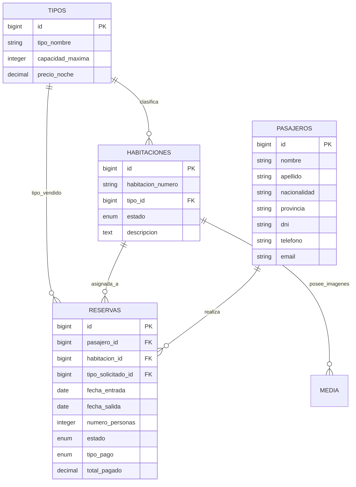

# Análisis integral del sistema hotelero

> Documento elaborado a partir del código fuente y la documentación disponible en el repositorio al 19 de agosto de 2026.

## 1. Resumen ejecutivo

El proyecto es un **sistema interno de gestión hotelera (PMS, Property Management System)** orientado principalmente al trabajo de recepción. Su objetivo es centralizar el inventario de habitaciones, los datos de huéspedes, la asignación de reservas, el registro manual de cobros y una consulta básica de ocupación.

El problema que intenta resolver es operativo: reemplazar registros dispersos o manuales por un flujo único donde el personal pueda saber qué habitaciones existen, su categoría y capacidad, qué pasajero se hospedará, durante qué fechas, qué unidad física se le asignó y qué importe se registró como pagado.

Una decisión de dominio importante es distinguir entre:

- el **tipo de habitación vendido** al cliente;
- la **habitación física asignada** finalmente.

Esto permite registrar un *upgrade*: por ejemplo, vender una habitación Doble y asignar una Suite disponible sin perder la categoría comercial original. Esa separación también permite que los reportes agrupen por lo vendido y no solamente por la unidad utilizada.

El producto actual es un **backoffice autenticado**, no una plataforma pública de reservas. El pasajero no crea ni consulta sus reservas, no existe disponibilidad pública, pasarela de pago, facturación ni integración con canales externos.

## 2. Fuentes utilizadas

El análisis se realizó contrastando:

- `CONTEXTO_PROYECTO.md`: descripción inicial del dominio y la arquitectura.
- `CAMBIOS_RECIENTES.md`: evolución reciente del flujo de reservas, identidad visual e idiomas.
- `README.md`: conserva el contenido genérico de Laravel y no describe el producto.
- `composer.json` y `package.json`: dependencias y comandos del proyecto.
- Modelos, migraciones y seeders de `app/Models` y `database`.
- Recursos, formularios, tablas, páginas y widgets de `app/Filament`.
- Configuración del panel en `app/Providers/Filament/AdminPanelProvider.php`.
- Rutas, configuración de Laravel y pruebas existentes.

Este documento describe el comportamiento observable en el código. Cuando la documentación previa y la implementación difieren, se considera al código como fuente principal.

## 3. Actores del sistema

### 3.1 Recepcionista u operador

Es el actor principal. Una vez autenticado puede administrar tipos de habitación, habitaciones, pasajeros y reservas, además de consultar el reporte de ocupación. El sistema busca reducir cambios de pantalla permitiendo crear un pasajero dentro del propio formulario de reserva.

### 3.2 Administrador

Es un rol conceptual, pero no está implementado como perfil diferenciado. No existen roles, permisos, policies o gates que separen tareas administrativas de las tareas de recepción.

### 3.3 Pasajero o huésped

Es una entidad gestionada por el personal. No tiene usuario, portal propio ni interacción directa con el sistema.

### 3.4 Visitante público

Puede acceder a la página inicial. La funcionalidad real se encuentra en `/admin`, protegida por autenticación de Filament.

## 4. Alcance funcional actual

### 4.1 Tipos de habitación

Representan categorías comerciales como Individual, Doble o Suite. Cada tipo define:

- nombre;
- capacidad máxima;
- precio por noche.

Un tipo puede tener muchas habitaciones físicas. El seeder carga un catálogo inicial, por lo que funciona como dato maestro para el resto de la operación.

### 4.2 Habitaciones

Representan las unidades físicas del hotel. Registran:

- número de habitación;
- tipo al que pertenecen;
- estado: `Disponible`, `Ocupada` o `Mantenimiento`;
- descripción enriquecida;
- una o varias imágenes, mediante Spatie Media Library.

### 4.3 Pasajeros

Centralizan la ficha básica del huésped:

- nombre y apellido;
- nacionalidad y provincia;
- DNI o pasaporte;
- teléfono y correo electrónico.

Se pueden administrar desde su ABM o crear rápidamente durante el alta de una reserva. El formulario rápido todavía no solicita nacionalidad ni provincia.

### 4.4 Reservas

Son la transacción central. Vinculan pasajero, tipo vendido y habitación asignada durante un intervalo de fechas. Además registran:

- cantidad de personas;
- estado: `Pendiente`, `Confirmada`, `Cancelada` o `Completada`;
- medio de pago: `Efectivo`, `Tarjeta` o `Transferencia`;
- total pagado.

El formulario utiliza un asistente de tres pasos: estadía, huésped/habitación y pago/estado.

### 4.5 Reporte de ocupación

El widget `ReporteVentasPorTipoWidget` permite elegir una fecha y agrupa reservas `Confirmadas` o `Completadas` activas en esa fecha. Informa:

- tipo de habitación vendido;
- cantidad de habitaciones ocupadas;
- total de huéspedes.

Aunque la clase se denomina “Ventas”, actualmente no calcula ingresos ni facturación: es un reporte de ocupación por categoría comercial.

### 4.6 Autenticación, idioma e identidad visual

El panel Filament ofrece login y recuperación de contraseña. Tiene logotipo, colores personalizados y diseño de autenticación con imagen. La documentación existente indica soporte español/inglés mediante un selector de idioma.

## 5. Flujo operativo principal

```mermaid
flowchart LR
    A[Configurar tipos] --> B[Crear habitaciones]
    B --> C[Registrar o seleccionar pasajero]
    C --> D[Indicar fechas y personas]
    D --> E[Buscar tipos con capacidad y disponibilidad]
    E --> F[Registrar tipo vendido]
    F --> G[Asignar habitación física]
    G --> H[Registrar estado, medio de pago y total]
    H --> I[Consultar ocupación por fecha]
```



### 5.1 Cálculo de disponibilidad

El scope `Habitacione::disponibles()` excluye una habitación cuando tiene otra reserva no cancelada que se solapa con el nuevo intervalo:

```text
entrada_existente < salida_nueva
y
salida_existente > entrada_nueva
```

La regla permite que una reserva comience el mismo día en que termina otra, un comportamiento razonable para check-out/check-in consecutivos.

Después de elegir fechas y cantidad de personas, el formulario:

1. muestra tipos cuya capacidad alcanza y que tienen al menos una habitación libre;
2. guarda el tipo vendido en `tipo_solicitado_id`;
3. muestra habitaciones libres con capacidad suficiente;
4. prioriza las del tipo vendido y etiqueta las restantes como *upgrade*.

## 6. Modelo de datos



`Reserva` es tratada tanto como entidad propia como tabla intermedia entre pasajeros y habitaciones. Esta duplicidad de relaciones es válida para consultas, aunque la relación directa `hasMany(Reserva::class)` expresa mejor el dominio porque la reserva tiene datos y comportamiento propios.

También existen tablas de infraestructura de Laravel para usuarios, recuperación de contraseña, sesiones, caché y colas, además de la tabla polimórfica `media`.

## 7. Arquitectura técnica

### 7.1 Estilo arquitectónico

Es un monolito Laravel 12 con interfaz administrativa declarativa en Filament 4 y Livewire. La arquitectura real es una variante de MVC donde Filament absorbe buena parte de las vistas y controladores tradicionales:

- **Eloquent Models:** persistencia y relaciones.
- **Filament Resources:** definición y registro de cada módulo.
- **Schemas:** formularios y reglas reactivas de interfaz.
- **Tables:** listados, búsquedas y acciones.
- **Pages:** altas, ediciones y listados CRUD.
- **Widgets:** consultas de reporte.
- **Panel Provider:** autenticación, middleware, branding y descubrimiento de componentes.

No hay controladores de negocio, servicios, Actions, eventos, listeners, jobs propios ni API. La lógica principal de disponibilidad se reparte entre un scope del modelo y closures del formulario de reservas.

### 7.2 Stack observado

- PHP `^8.2` en Composer; las directivas del proyecto señalan PHP 8.3 como entorno objetivo.
- Laravel 12.
- Filament 4, Livewire y Tailwind CSS 4.
- Vite para activos frontend.
- Pest 4 y PHPUnit 12.
- Spatie Media Library y su integración con Filament.
- Plugin de diseño de autenticación.
- Plugin de cambio de idioma.

### 7.3 Superficies de acceso

- `/`: landing pública renderizada con Blade.
- `/admin`: panel autenticado de Filament y sus rutas CRUD generadas.

No se detectaron endpoints API ni un frontend transaccional separado.

## 8. Integraciones y límites actuales

### Integraciones presentes

- almacenamiento y asociación de imágenes con Spatie Media Library;
- interfaz administrativa con Filament;
- diseño personalizado del login;
- selector de idioma.

### Capacidades no implementadas

- motor público de reservas;
- pagos en línea o conciliación bancaria;
- facturación y comprobantes fiscales;
- channel manager u OTA como Booking/Airbnb;
- housekeeping y tareas de limpieza;
- mantenimiento con órdenes de trabajo;
- tarifas estacionales, promociones o impuestos;
- múltiples pasajeros por reserva con ficha individual;
- habitaciones múltiples dentro de una misma reserva;
- check-in/check-out como eventos auditables;
- notificaciones operativas por correo o mensajería;
- API e integraciones contables;
- multi-hotel o multi-sucursal.

Por lo tanto, `tipo_pago` y `total_pagado` son datos manuales, no evidencia de una transacción procesada por el sistema.

## 9. Fortalezas actuales

- El núcleo del dominio es pequeño y comprensible.
- La separación entre tipo vendido y habitación asignada representa correctamente los upgrades.
- La fórmula de solapamiento de fechas permite estadías consecutivas.
- Filament proporciona rápidamente CRUD, búsqueda, formularios reactivos y autenticación.
- El alta rápida de pasajeros mejora el flujo de recepción.
- Las imágenes de habitaciones están desacopladas mediante Media Library.
- Migraciones, claves foráneas y `$fillable` ofrecen una base razonable de persistencia.
- El reporte usa el tipo vendido, lo cual preserva la lectura comercial de la ocupación.

## 10. Brechas y riesgos detectados

### 10.1 Prioridad crítica

#### Doble reserva por concurrencia o manipulación de la solicitud

La disponibilidad se usa para construir las opciones del formulario, pero no existe una validación autoritativa inmediatamente antes de guardar, ni transacción con bloqueo. Dos operadores podrían ver la misma habitación disponible y reservarla simultáneamente. Una solicitud manipulada también podría enviar una habitación que no aparece en las opciones.

#### Autorización sin roles ni permisos

El panel exige autenticación, pero no se observan policies, gates, roles, permisos o restricciones de acceso al panel por tipo de usuario. En consecuencia, todo usuario autenticado aparenta poder acceder a todos los módulos, incluidos borrados individuales y masivos.

#### Pérdida de historial por borrado en cascada

Eliminar un pasajero o una habitación elimina sus reservas. Eliminar un tipo elimina sus habitaciones y, transitivamente, sus reservas. Esto puede destruir historial operativo y financiero. Para un PMS suele ser preferible impedir el borrado, archivar o aplicar borrado lógico.

### 10.2 Prioridad alta

#### Mantenimiento no excluido de la disponibilidad

El scope comprueba reservas solapadas, pero no filtra el estado de la habitación. Una unidad marcada `Mantenimiento` puede ser ofrecida para una nueva reserva si no tiene solapamientos.

#### Reglas solamente en la interfaz

No se garantiza en una capa de dominio que:

- la cantidad de personas no supere la capacidad;
- el tipo vendido esté disponible;
- la habitación asignada sea válida para las fechas;
- la habitación tenga capacidad suficiente;
- la salida sea posterior a la entrada;
- un cambio posterior de una reserva siga respetando disponibilidad.

Estas reglas deberían existir fuera de las closures de Filament para que sean reutilizables y testeables.

#### Estado de habitación desacoplado

`Disponible`/`Ocupada` es editable manualmente y no se sincroniza con el estado o fechas de las reservas. Esto crea dos fuentes de verdad que pueden contradecirse.

#### Información personal sin controles específicos

DNI, teléfono y correo carecen de autorización granular, auditoría, cifrado o política de retención observable. Tampoco hay trazabilidad de quién creó o modificó una reserva.

### 10.3 Prioridad media

- `dni`, correo de pasajero y `habitacion_numero` no tienen restricciones únicas.
- No hay índices compuestos específicos para búsquedas de solapamiento por habitación, fechas y estado.
- El precio por noche no se utiliza para calcular el importe esperado; `total_pagado` se ingresa manualmente.
- Se permite salida igual a entrada mediante `after_or_equal`, lo que admite estadías de cero noches.
- Los modelos de dominio no convierten fechas ni importes con casts explícitos.
- Los métodos de relaciones y scopes no tienen tipos de retorno.
- El nombre singular `Habitacione` y `HabitacioneResource` es anómalo y aumenta la deuda de nomenclatura.
- La tabla de pasajeros referencia `teléfono` con tilde, mientras el atributo persistido es `telefono`; esa columna probablemente aparece vacía.
- `preload()` puede cargar demasiados pasajeros al crecer la base.
- La lista de habitaciones disponibles carga resultados y los ordena en PHP; escalará peor que una consulta acotada.
- El upload de imágenes no declara límites visibles de MIME, tamaño o cantidad.
- El editor enriquecido almacena HTML, que debe tratarse como contenido no confiable al renderizarlo.
- La migración de `media` no define rollback, por lo que no es totalmente reversible.
- El reporte carece de ingresos, porcentajes de ocupación, habitaciones disponibles y comparación temporal.

## 11. Estado de las pruebas

Pest está instalado, pero la cobertura real es prácticamente nula:

- un test verifica que `/` devuelve HTTP 200;
- un test unitario verifica que `true` sea verdadero;
- `RefreshDatabase` está comentado;
- no existen factories para los modelos del dominio.

No hay pruebas sobre disponibilidad, solapamientos, concurrencia, capacidad, upgrades, estados, autorización, CRUD de Filament, borrados, reporte, carga de imágenes ni validaciones de datos.

Esto significa que las reglas centrales no están protegidas frente a regresiones.

## 12. Evaluación de madurez

| Área | Estado | Evaluación |
|---|---|---|
| Catálogo de habitaciones | Funcional básico | Adecuado para inventario pequeño |
| Gestión de pasajeros | Funcional básico | Requiere unicidad, privacidad y auditoría |
| Reservas | Prototipo avanzado | Buen flujo UX, reglas críticas aún no blindadas |
| Disponibilidad | Parcial | Correcta fórmula temporal, débil ante concurrencia y mantenimiento |
| Cobros | Registro manual | No constituye módulo financiero |
| Reportes | Inicial | Solo ocupación agregada por fecha y tipo vendido |
| Seguridad | Básica | Autenticación presente, autorización granular ausente |
| Calidad automática | Inicial | Pruebas de plantilla únicamente |
| Escalabilidad | No validada | Consultas y preload pensados para volúmenes bajos |
| Documentación | Parcial | Hay contexto útil, pero el README y el estado actual divergen |

En conjunto, el sistema se encuentra en una etapa de **MVP operativo/backoffice temprano**: ya modela el proceso principal y ofrece una interfaz utilizable, pero todavía necesita endurecer integridad, autorización y pruebas antes de considerarse confiable para una operación hotelera real con múltiples usuarios.

## 13. Hoja de ruta recomendada

### Fase 1: integridad operativa

1. Extraer la creación/modificación de reservas a una Action o servicio de dominio.
2. Revalidar disponibilidad dentro de una transacción y aplicar bloqueo para evitar carreras.
3. Excluir habitaciones en mantenimiento y definir una única fuente de verdad para ocupación.
4. Validar fechas, capacidad, tipo vendido y habitación en servidor.
5. Proteger el historial reemplazando cascadas destructivas por restricciones, archivado o soft deletes.
6. Agregar pruebas de reserva, solapamiento y concurrencia.

### Fase 2: seguridad y calidad de datos

1. Implementar roles/permisos y policies para cada recurso y acción.
2. Restringir borrado masivo y acceso al panel.
3. Agregar unicidad e índices después de depurar datos existentes.
4. Incorporar auditoría de cambios y responsables.
5. Definir controles para datos personales y archivos subidos.
6. Crear factories y pruebas de Filament para los cuatro módulos.

### Fase 3: operación hotelera

1. Formalizar check-in, check-out, no-show y cancelación.
2. Incorporar acompañantes o huéspedes adicionales.
3. Calcular noches, tarifa, impuestos, descuentos, saldo y pagos parciales.
4. Agregar calendario de ocupación y bloqueo de habitaciones.
5. Separar mantenimiento/limpieza de la disponibilidad comercial.
6. Mejorar reportes de ocupación, ADR, RevPAR e ingresos.

### Fase 4: expansión e integraciones

1. Portal público o motor de reservas, si forma parte del negocio.
2. Pagos, facturación y notificaciones.
3. Integraciones OTA/channel manager.
4. API versionada para consumidores externos.
5. Multi-hotel únicamente si aparece una necesidad real.

## 14. Conclusión

El sistema intenta resolver de forma directa la coordinación diaria entre **inventario, huésped, estadía y cobro**. Su mayor acierto conceptual es conservar por separado la categoría vendida y la habitación entregada. Filament permite que esa idea ya tenga una interfaz de trabajo clara y rápida.

La principal brecha no está en la apariencia sino en las garantías del dominio: hoy la UI guía al usuario correctamente, pero la capa de aplicación no asegura todas las reglas frente a concurrencia, datos manipulados o acciones destructivas. La siguiente etapa debería priorizar integridad de reservas, autorización y pruebas antes de ampliar funcionalidades.
